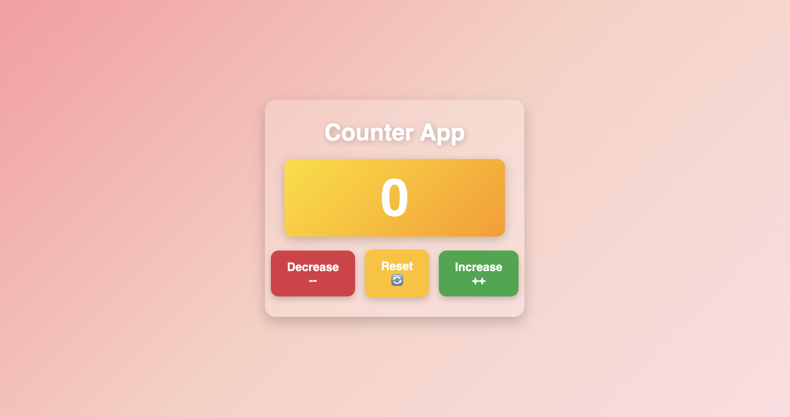

# Counter App

A simple Counter App built with HTML, CSS, and JavaScript. This app allows users to increase, decrease, or reset a counter value.

## Preview



## Features

- **Increase Button**: Increments the counter value by 1.
- **Decrease Button**: Decrements the counter value by 1.
- **Reset Button**: Resets the counter value to 0.

## Project Structure

```
Counter App/
├── index.html       # Main HTML file
├── style.css        # Styling for the app
├── script.js        # JavaScript functionality
```

## How to Use

1. Open the `index.html` file in any modern web browser.
2. Use the buttons to interact with the counter:
   - **Decrease**: Decrease the counter value.
   - **Reset**: Reset the counter to 0.
   - **Increase**: Increase the counter value.


## Technologies Used

- **HTML**: For the structure of the app.
- **CSS**: For styling the app.
- **JavaScript**: For adding interactivity.

## How to Run Locally

1. Clone this repository or download the project files.
2. Open the `index.html` file in your browser.

## Future Enhancements

- Add animations for button clicks.
- Allow users to set a custom increment/decrement value.
- Add a dark mode toggle.

## Author
This project was created by Aryan Raj. Feel free to contribute or suggest improvements!

## License

This project is open-source and available under the [MIT License](LICENSE).